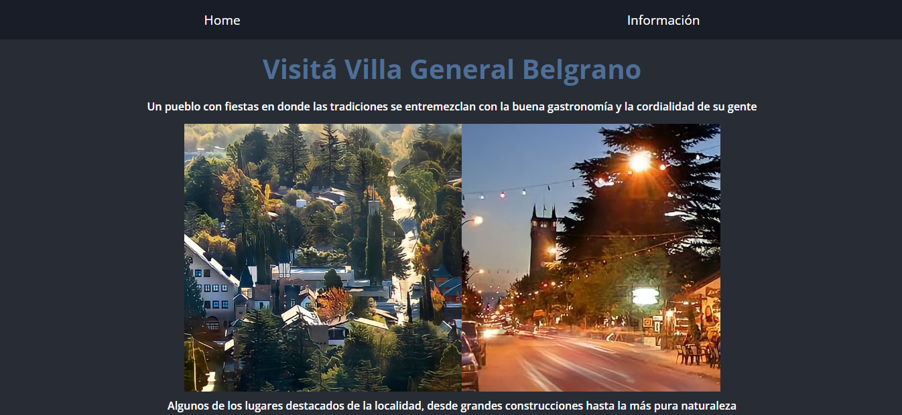

# Proyecto Final - Yo Puedo Programar

Para finalizar el curso Yo Puedo Programar de Junior Achievement Argentina, se nos encargó realizar en equipo una página web utilizando HTML, CSS Y JavaScript.
 Junto a mi compañero, decidimos crear una aplicación dedicada a promocionar una localidad de Córdoba, que incluye las siguientes caracteristicas:

- Un inicio con imágenes que se cambian automáticamente
- Un NavBar
- Un Footer
- Un video informativo sobre la localidad
- Botones que despliegan información
- Un mapa con la ubicación de la localidad

